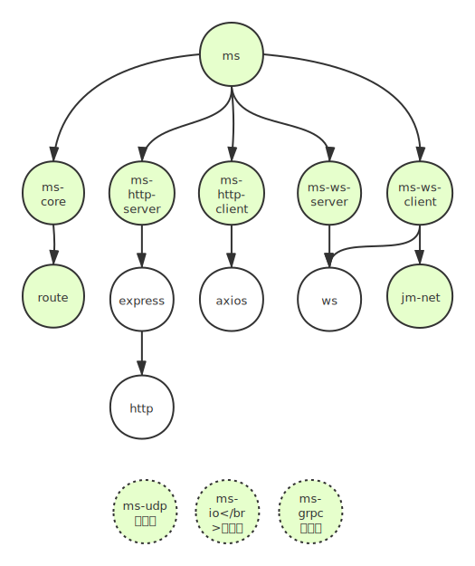

# 微服务库 ms

## 为什么

微服务的接口一般被设计成标准的RESTful，支持标准的Http协议。

但是，实际项目中有很多Http协议处理不好的问题。

- 客户端需要长连接时，需要考虑Websocket协议。
- 微服务之间通讯时，采用TCP或者UDP协议，性能通常可以提高75%以上。
- 有时候我需要做带业务逻辑的proxy转发，用nginx实现不了，比如实现一个路由，先鉴权再转发相应请求到目标微服务上。
- 如果开发者已经基于express实现了接口，现在想支持UDP协议，就必须基于新的协议对于接口重新设计和实现，这会浪费很多宝贵的时间。

ms 的设计就是为了很好的解决这些问题。

## ms 家谱



## ms-core
ms-core 是 ms 的核心，下面用代码例子描述其主要功能。

```javascript
// 定义一个函数
function hello(opts) {
    const {data} = opts
    return {ret: data}
}

// 直接调用
hello({data: { msg: 'hello'}})

// 定义一个服务，包含两个函数
const service = {
    hello: hello,
    hello2: hello
}

// 调用服务
service.hello({data: { msg: 'hello'}})
service.hello2({data: { msg: 'hello'}})

// ms-core 希望开发者可以这样调用服务
const data = {msg: 'hello'}
router.request('/hello', 'get', data) // service.hello({data: data})
router.get('/hello2', data) // service.hello2({data: data})
// 以及这样调用
router.request({uri: '/hello', type: 'get', data: data})
```

为此 ms-core 定义了路由器 Router。

### router
代表一个路由器，可以为一个路由器定义一条以上的路由规则，这些规则统一构成路由器的路由表。

```javascript
// 引入
const MS = require('jm-ms-core')

// 定义一个函数
function hello(opts) {
    const {data} = opts
    return {ret: data}
}

// 创建一个路由器
const ms = new MS()
const router = ms.router()

// 为路由器添加路由规则,支持多种方式,支持链式
router
    .add('/hello', 'get', hello)

// 通过路由器发起请求
const data = {msg: 'hello'}
router.request('/hello', 'get', data)
    .then(doc=>{console.log(doc)})

```
